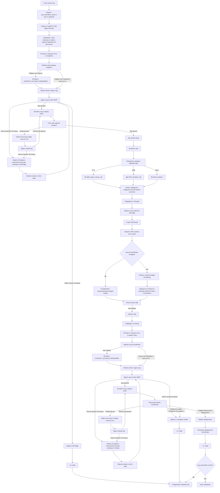

# Codex Helper flow overview

Этот файл показывает текущую логику полного цикла `reg` в `codex_helper_app.py`.

## Основные точки отказа

- `ChatGPT` шаг resend и invalid-code retry работают только в `MS Edge`.
- `OmniRoute` шаг resend и invalid-code retry работают только в `Yandex Browser`.
- После reject-сценария `OmniRoute` вкладка reuse сбрасывается, и следующая
  итерация открывает `OmniRoute` заново как первую.
- Inspector на `стрелке вниз` не меняет поток, а только собирает debug-дамп
  активного окна.

## Где смотреть код

- Основной файл: `codex_helper_app.py`
- Логи: `codex_helper.log`
- Inspector hotkey: `стрелка вниз`
